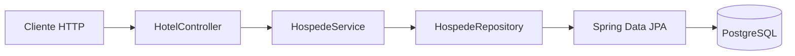

# Velune

Projeto de estudo para praticar Java e construir, passo a passo, um sistema de gestão hoteleira. O repositório reúne exercícios de orientação a objetos e uma API REST para cadastro e consulta de hóspedes com Spring Boot, JPA e PostgreSQL.

> **Status:** projeto em desenvolvimento. A API persistida atualmente cobre o fluxo de hóspedes; os módulos de RH e reservas são demonstrações de regras de negócio em memória.

## O que o projeto faz

### API de hóspedes

- Cadastra hóspedes no PostgreSQL usando Spring Data JPA.
- Lista os hóspedes cadastrados.
- Busca um hóspede pelo documento.
- Valida nome e documento obrigatórios.
- Impede o cadastro de um documento já utilizado.
- Responde com `404 Not Found` quando a busca pelo documento não encontra um hóspede.

### Regras de negócio em memória

- **RH:** funcionários, cargos, salários, bônus, escalas e notificações.
- **Reservas:** disponibilidade de quartos, períodos de hospedagem, cancelamentos e cálculo de valores.

Esses módulos ajudam a demonstrar conceitos de orientação a objetos, mas ainda não têm endpoints REST nem persistência no banco.

## Tecnologias

- Java 25
- Spring Boot 4.1.1
- Spring Web e Bean Validation
- Spring Data JPA / Hibernate
- PostgreSQL
- Maven
- JUnit e Mockito

## Arquitetura da API



O controller recebe as requisições HTTP, o service aplica as regras do fluxo de hóspedes e o repositório acessa o banco por meio do JPA.

## Interface web

A interface fica em `src/main/resources/static` e é servida pelo Spring Boot. Com a aplicação iniciada, abra `http://localhost:8080`.

Hóspedes, quartos e reservas usam os endpoints REST do projeto. A criação de quartos usa `POST /quartos` com JSON; a equipe e alguns indicadores de agenda ainda são exemplos visuais, pois esse módulo não tem API REST.
## Endpoints

| Método | Rota | Descrição | Resposta de sucesso |
|---|---|---|---|
| `GET` | `/hotel` | Verifica se a aplicação está respondendo | `200 OK` |
| `GET` | `/hospedes` | Lista os hóspedes | `200 OK` |
| `GET` | `/hospedes/{documento}` | Busca pelo documento | `200 OK` ou `404 Not Found` |
| `POST` | `/hospedes` | Cadastra um hóspede | `200 OK` |

### Cadastrar hóspede

```bash
curl -X POST http://localhost:8080/hospedes \
  -H "Content-Type: application/json" \
  -d '{"nome":"Ana Souza","documento":"12345678900"}'
```

```json
{
  "nome": "Ana Souza",
  "documento": "12345678900"
}
```

O cadastro exige `nome` e `documento`. Campos em branco e documentos já cadastrados retornam `400 Bad Request` com uma mensagem de erro. No sucesso, o endpoint retorna `200 OK` sem corpo de resposta.

### Consultar hóspede

```bash
curl http://localhost:8080/hospedes/12345678900
```

Quando encontrado, o endpoint retorna `200 OK` e um JSON semelhante a este:

```json
{
  "id": 1,
  "nome": "Ana Souza",
  "documento": "12345678900"
}
```

Caso contrário, retorna `404 Not Found`. Para listar todos os hóspedes, use `GET /hospedes`.

### Listar hóspedes

```bash
curl http://localhost:8080/hospedes
```

A resposta é uma lista JSON; quando não há hóspedes cadastrados, a lista vem vazia:

```json
[
  {
    "id": 1,
    "nome": "Ana Souza",
    "documento": "12345678900"
  }
]
```

## Executar localmente

### Pré-requisitos

- JDK 25
- Maven
- PostgreSQL

Clone o repositório e crie o banco configurado pela aplicação:

```bash
git clone https://github.com/MarcosEduardoDev/Velune.git Velune
cd Velune
```

No PostgreSQL, crie o banco e prepare a tabela e a sequência usadas pela entidade `Hospede`:

```sql
CREATE DATABASE "Velune";
```

Conectado ao banco `Velune`, execute:

```sql
CREATE SEQUENCE hospede_id_seq START WITH 1 INCREMENT BY 1;

CREATE TABLE hospede (
    id BIGINT PRIMARY KEY,
    nome VARCHAR(255) NOT NULL,
    documento VARCHAR(255) NOT NULL UNIQUE
);
```

Configure a conexão por variáveis de ambiente. Elas sobrescrevem as propriedades equivalentes e ajudam a manter credenciais fora do código. Não publique senhas reais no repositório.

PowerShell:

```powershell
$env:SPRING_DATASOURCE_URL = "jdbc:postgresql://localhost:5432/Velune"
$env:SPRING_DATASOURCE_USERNAME = "seu_usuario"
$env:SPRING_DATASOURCE_PASSWORD = "sua_senha"
```

macOS ou Linux:

```bash
export SPRING_DATASOURCE_URL="jdbc:postgresql://localhost:5432/Velune"
export SPRING_DATASOURCE_USERNAME="seu_usuario"
export SPRING_DATASOURCE_PASSWORD="sua_senha"
```

Com o banco preparado e as variáveis definidas no ambiente, inicie a aplicação:

```bash
mvn spring-boot:run
```

> **Atenção:** há pendências de compilação conhecidas no projeto. O comando acima descreve a forma esperada de inicialização depois que elas forem resolvidas.

## Estrutura do projeto

```text
src/
├── main/
│   ├── java/velune/
│   │   ├── controller/   # Endpoints REST
│   │   ├── dto/          # Objetos de entrada e validação
│   │   ├── exception/    # Exceções e tratamento de erros
│   │   ├── model/        # Entidades JPA e modelos de domínio
│   │   ├── repository/   # Acesso a dados com Spring Data JPA
│   │   └── service/      # Regras de negócio
│   └── resources/        # Configuração da aplicação
└── test/                # Testes automatizados
```

## Conceitos praticados

- Encapsulamento, composição, herança, interfaces e polimorfismo.
- Enums com comportamento específico por cargo.
- Collections, Streams, lambdas e `Optional`.
- Exceções personalizadas e validação de entrada.
- API REST, injeção de dependência e separação entre controller, service e repository.
- Mapeamento de entidades e persistência com JPA.

## Próximos passos

- Consolidar a configuração segura do banco e o processo de inicialização do schema.
- Ampliar e atualizar os testes automatizados.
- Evoluir os módulos de RH e reservas para persistência e API REST.
- Adicionar documentação interativa dos endpoints.
- Implementar autenticação e autorização antes de usar dados reais.

## Limitações atuais

- A API ainda não tem autenticação ou autorização; use apenas dados fictícios.
- RH e reservas funcionam em memória e não fazem parte da API REST atual.
- O projeto não inclui migrações de banco; a criação inicial da tabela e da sequência é manual.
- A compilação e os testes ainda precisam ser regularizados.

---

Projeto desenvolvido para fins de estudo e evolução prática em desenvolvimento backend com Java.

